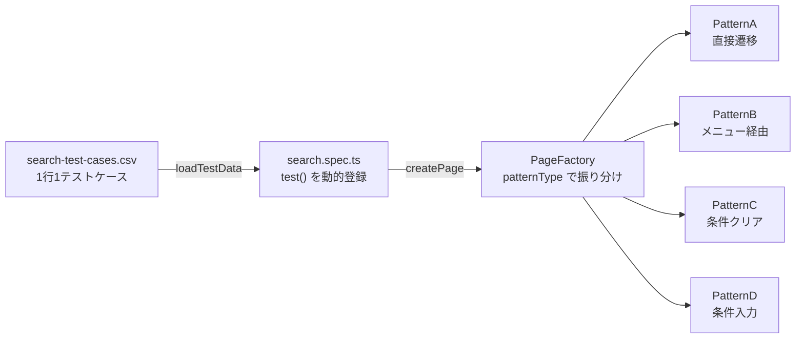

## 背景と戦略

SIer の現場では「テストは手動」という慣習が根強く、自動テストの導入は文化・技術・組織の壁に阻まれます。  
本プロジェクトは、**テストコードが皆無だった実務環境**において、以下の戦略で 115 機能の自動化を完遂した際の基盤をベースとしています。

1. **実績で示す:** 「まず動くもの」を作り、115 機能完遂という事実で組織を動かす。
2. **共通パターンの抽象化**: 多くの画面に共通する振る舞いをパターン化することで、全 350 機能のうち主要な 1/3（115 機能）の自動化を短期間で完遂する。

ポートフォリオとして再構築するにあたり、「115 という数字そのものよりも、そのスケールを可能にした設計思想を伝えること」を最優先しました。

### このリポジトリが示すもの

115 機能を自動化するにあたり、最初に直面した問題は「**画面ごとに個別の Page Object を作ると、最終的に 115 クラスの保守が発生する**」という現実です。人員が限られた現場でこれは持続不可能でした。

その解決策として採用したのが「**振る舞いベースの Page Object Model**」です。画面の数ではなく、テストの振る舞いのパターン数でクラスを管理することで、新規画面の追加コストを最小限に近づけています。

## 主要な設計思想

### 振る舞いベースの POM と Factory Pattern

#### 問題：画面ベース POM のスケール限界

```
画面ベース POM の場合:
  SearchPage_A.ts, SearchPage_B.ts, ... , SearchPage_115.ts
  → 画面が増えるたびにクラスが増え、共通変更の影響範囲が広がる
```

多くの E2E テストの教科書は「画面ごとに Page Object を作る」と教えます。5〜10 画面なら問題ありません。しかし 115 画面では、フォームの仕様変更が発生するたびに数十クラスを修正する事態になりかねません。

#### 解決：振る舞いのパターンで分類する

実務の 115 機能を観察すると、今回の応答速度テストの振る舞いは以下の 4 パターンに収束することがわかりました。

| パターン | 振る舞い                        | 対象画面の例                   |
| -------- | ------------------------------- | ------------------------------ |
| A        | URL 直接遷移 → 条件なし検索     | 標準的な検索画面               |
| B        | メニュー経由遷移 → 条件なし検索 | セッション引き継ぎが必要な画面 |
| C        | 条件クリア → 検索               | 前画面の条件が残存する画面     |
| D        | 条件入力 → 検索                 | フィールド入力が必要な検索画面 |

新規画面の追加は、この 4 パターンのどれかを CSV で指定するだけで完結します。



#### Factory Pattern：テストスペックを具体的なクラスから切り離す

```typescript
// tests/search.spec.ts — テストスペックは BasePage しか知らない
for (const data of loadTestData(CSV_PATH)) {
  test(data.testCaseName, async ({ page }) => {
    const pageObj = PageFactory.createPage(page, data); // ← 何クラスかを知らない
    await pageObj.execute();
  });
}
```

テストスペックを変更せずに新しいパターンを追加できる構造です。`PageFactory` への `case` 追加と新サブクラスの定義だけで完結し、`search.spec.ts` は一切触りません。

---

### Template Method パターン：テストフローの固定と差分の委譲

振る舞いベース POM が機能する前提として、「**全パターンに共通するテストフローを1箇所で定義し、画面固有の差分だけをサブクラスで表現できること**」が必要です。

`BasePage` はこの役割を Template Method パターンで実現しています。`execute()` が5ステップの固定シーケンスを定義し、各ステップは `protected` メソッドとしてサブクラスに公開されています。

```
execute()
  ├─ navigate()          → 対象ページへ遷移する
  ├─ prepareForSearch()  → 検索前の事前操作（デフォルトは何もしない）
  ├─ submitSearch()      → 検索ボタン押下・APIレスポンス待機・パフォーマンス計測
  ├─ verifyResult()      → 検索結果の表示を検証する
  └─ captureScreenshot() → 結果画面のスクリーンショットを保存する
```

たとえばパターン B は `navigate()` のみをオーバーライドします。パターン C と D は `prepareForSearch()` をオーバーライドします。フローの順序や `submitSearch()` の計測ロジックはどのパターンも変更できません。

```typescript
// pages/search-page.ts — パターンCは事前操作だけを上書きする
export class SearchPagePatternC extends BasePage {
  protected async prepareForSearch(): Promise<void> {
    await clearAllFormInputs(this.page); // ← ここだけが差分
  }
}
```

「全パターンが同じフローを辿る」という制約を Template Method で強制することで、パターンを追加しても計測・検証・スクリーンショット保存の漏れが発生しない構造になっています。

---

### 汎用的な DOM 操作：特定の画面構造に依存しない

振る舞いベース POM がスケールするためのもう一つの条件は、「**操作ロジックが特定の画面の ID や構造に依存しないこと**」です。

`utils/form-utils.ts` はこの原則を 2 つの関数で実現しています。

#### `getFillableInputsSortedByPosition()` — パターン D：入力順の動的解決

パターン D（条件入力）は、CSV の `searchConditions` 配列をフォームフィールドへ位置順に対応付けます。この対応を「フィールド ID」ではなく「**`boundingBox()`APIを用いて実行時に動的取得した描画座標**」を根拠にすることで、ID の変更に耐性を持たせています。

```
フィールド ID に依存する場合:
  #FreeWord → fill("管理")
  #SectionCd → fill("A001")
  ↑ ID が変わるたびにコードを修正しなければならない

実行時の DOM 座標に依存する場合:
  テスト実行のたびに各フィールドの描画座標を読み取り、
  「画面上で何行目・何列目か」という位置でソートする
  ↑ ID が変わっても、視覚的な配置が変わらない限り動作する
```

処理の流れ：

1. **実行時座標取得** — CSS セレクターで取得した全可視入力要素に対し、`field.boundingBox()` を呼び出してブラウザがレンダリングした各フィールドの `(x, y)` 座標を取得します。テスト実行のたびに DOM から動的に読み取られます。

2. **同一行グルーピング（ROW_TOLERANCE）** — フォームレイアウトによって横並びフィールドの y 座標が数 px ずれる場合があります。`ROW_TOLERANCE = 10` を設けることで、y 差が 10px 以内の要素を「同一行」とみなし、複数列フォームでも正しく行単位にグループ化します。

3. **2 段階ソート** — まず y 昇順（行方向）でグルーピングし、各行内を x 昇順（列方向）に整列します。結果として「1 行目：左→右、2 行目：左→右」という自然な読み取り順の Locator 配列が返ります。

この配列の 0 番目が `searchConditions[0]`、1 番目が `searchConditions[1]` に対応するため、CSV 記述者は「上から数えて何番目のフィールドか」という直感的なルールで入力値を指定できます。

#### `clearAllFormInputs()` — パターン C：クリアボタン不要の汎用リセット

パターン C（条件クリア）も同じ原則に従います。クリアボタンの ID を指定する代わりに、CSS セレクターで取得した全可視入力要素を直接 `fill("")` / `selectOption({ index: 0 })` で初期化します。

`hidden` / `submit` / `button` / `checkbox` / `radio` はセレクターで明示的に除外し、誤操作によるフォーム送信や UI 破壊を防いでいます。`select` 要素の「クリア」は「最初のオプションへ戻すこと」として扱い、クリア後に `expect` で値の反映を再検証することで、React 等のバインディングによる上書きにも対応しています。

---

この 2 関数に共通する設計方針：**「何という名前か（ID・クラス）」ではなく「画面上のどこにあるか・何の種類か」を根拠に操作する**。これにより、CSS リファクタリングや ID 命名規則の変更に対してテストコードが構造的な耐性を持ちます。

## 実務における課題と解決アプローチ

モックサイトは簡易な構成ですが、実務で実際に起きた「E2E テスト特有の厄介な課題」を意図的に再現しています。

### 課題 1：同一 Path への同時 POST によるレスポンスの誤捕捉

**実務での状況:**
検索ボタン押下時、アプリケーションは `/api/gateway` に対してほぼ同タイミングで 2 種類の POST を送信します——監視対象の `SEARCH` イベントと、監視不要な `LOG` イベントです。

`waitForResponse('/api/gateway')` という素直な実装では、先に返ってきた `LOG` レスポンスを捕捉してしまい、後続の検証が誤ったデータに対して走る Flaky テストが発生します。

**本基盤での解決策:**

URL・HTTPメソッド・ステータスコード・リクエストボディの**4条件でフィルタリング**し、`SEARCH` イベントを持つレスポンスのみを明示的に識別します。

```typescript
this.page.waitForResponse(async (res) => {
  if (!res.url().includes("/api/gateway")) return false;
  if (res.request().method() !== "POST") return false; // GETリクエストを除外
  if (res.status() !== 200) return false; // エラーレスポンスを除外
  try {
    const body = await res.request().postDataJSON();
    return body?.events?.[0]?.type === "SEARCH"; // LOGイベントを除外
  } catch {
    return false;
  }
});
```

加えて、`waitForResponse` の登録とボタンの `click()` を `Promise.all` で**同時に開始**します。`click()` の後にリスナーを登録すると、高速な環境ではレスポンスの受信に間に合わない race condition が生じるためです。

---

### 課題 2：画面遷移に依存した暗黙のパラメータ（`search-inherited.html`）

**実務での状況:**
実務ではしばしば、前画面から遷移しなければセッションに必要なパラメータがセットされず、検索結果が 0 件になる仕様の画面に遭遇します。URL を直接開くと 0 件が返るため、テストは「正しく動作しているが実は間違った経路を検証している」状態になります。

**本基盤での再現と解決策:**

`search-inherited.html` はこの挙動を意図的に再現しています。`companyCd` をメニュー画面経由でのみ取得できる構造になっており、直接遷移すると 0 件が返ります。

この画面に対するテストケースはパターン B を指定します。パターン B は `navigate()` をオーバーライドし、メニュー画面を経由してから対象画面へ遷移する振る舞いを持ちます。テストスペックは経路の違いを知らず、CSV の `patternType: "B"` という一行の宣言で解決します。

```csv
testCaseName,targetPage,patternType,searchConditions
TC-002_メニュー経由_条件なし検索,search-inherited.html,B,
```

## 計測結果の可視化

本基盤では、テスト実行と同時に各 API のレスポンスタイムを自動計測し、複数の形式で記録します。
（GitHub 上で実際の出力サンプルを確認できます）

- **[JSON 形式（詳細ログ）](./output/perf-log-sample.json)**: 総応答時間とサーバー内処理（serverDelayMs）を記録。ネットワーク遅延の切り分けが可能です。
- **[CSV 形式（要約レポート）](./output/perf-summary-sample.csv)**: GitHub上で表形式で確認可能な、共有用サマリーです。

## 周辺業務の自動化：エビデンス作成の効率化

### 背景

SIer の現場では、テスト実行後に「スクリーンショットを 1 枚ずつ Excel に貼り付け、シート名を付ける」という手作業のエビデンス整理が慣習として残っています。テストケース数が増えるほど、この工程は無視できない工数になります。

自動化の対象はテスト実行そのものではなく、テスト「後」の証跡整理という**周辺業務**です。

### 解決策

`scripts/excel_evidence_gen.py` は、`output/screenshots/` に保存された PNG を読み込み、**1 ファイル 1 シート**の Excel エビデンスファイルを自動生成します。

- **[生成サンプル（Excel）](./output/evidence_sample.xlsx)**: 実際に自動生成されたエビデンスファイルを確認できます。
- シート順は `TC-001`, `TC-002` … のファイル名昇順に自動整列
- シート名マッピングテーブルにより、ファイル名を日本語の証跡シート名へ変換可能

### 技術選定の考え方

本プロジェクトの主軸は TypeScript / Playwright ですが、Excel 操作についてはライブラリが豊富な Python を選択しました。  
AI を活用して実装コストを抑えつつ、特定の言語に固執せず、タスクの性質に合わせて最も合理的な道具を使い分ける柔軟性を意識しています。

### 使用方法

```bash
# 仮想環境の作成と依存ライブラリのインストール
cd scripts
python -m venv .venv
source .venv/bin/activate  # Windowsの場合は .venv\Scripts\activate
pip install -r requirements.txt

# ツールの実行
python excel_evidence_gen.py
```

## 技術スタック

|                      |                   |
| -------------------- | ----------------- |
| テストフレームワーク | Playwright        |
| 言語(メイン)         | TypeScript        |
| 言語(ユーティリティ) | Python            |
| モックサーバー       | Node.js / Express |

## 実行手順

1. 前提条件  
   Node.js (v18 以上推奨) がインストールされていること

2. セットアップ  
   リポジトリをクローン後、ルートディレクトリで以下のコマンドを実行します。

```bash
# 依存パッケージのインストール（本体およびモックアプリ）
npm install
npm install --prefix mock-app

# Playwright ブラウザのインストール
npx playwright install
```

プロジェクトルートに `.env` ファイルを作成し、テスト用の認証情報を記載します。

```bash
# モックアプリに対するログインのため、任意の値で可
TEST_USER_ID=your_id
TEST_PASSWORD=your_password
```

3. モックサーバーの起動  
   テスト対象となるローカルサーバーを起動します。

```bash
# ルートディレクトリ、または mock-app ディレクトリのどちらでも実行可能です
npm start
```

4. テストの実行  
   サーバーを起動したまま、別のターミナルを開いて以下を実行します。

```bash
# テストの実行
npx playwright test

# HTML レポートの表示（実行後）
npx playwright show-report
```

## 最後に

本プロジェクトは、限られた時間と制約の中で「いかに合理的に、かつスケールの土台を崩さずに自動化を推進するか」を追求した一つの形です。

実務での経験を通じて培った設計思想を、今回ポートフォリオとして改めて再構築したことで、その汎用性と有効性を自分自身で再確認することができました。
この経験と成果を武器に、次のステップではより大規模、かつ複雑なプロダクトの品質保証を支える技術基盤の構築に挑戦したいと考えています。
